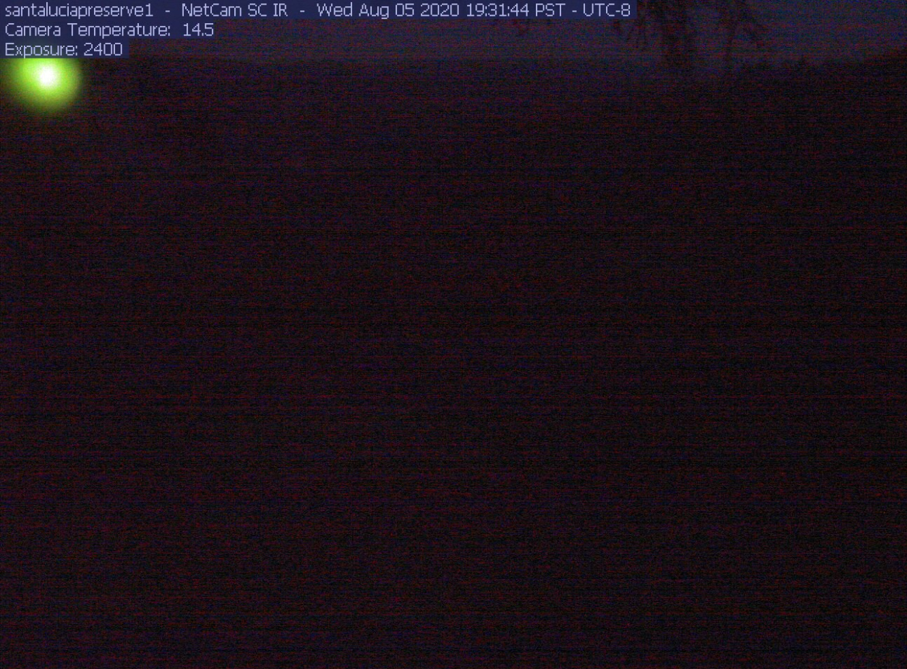
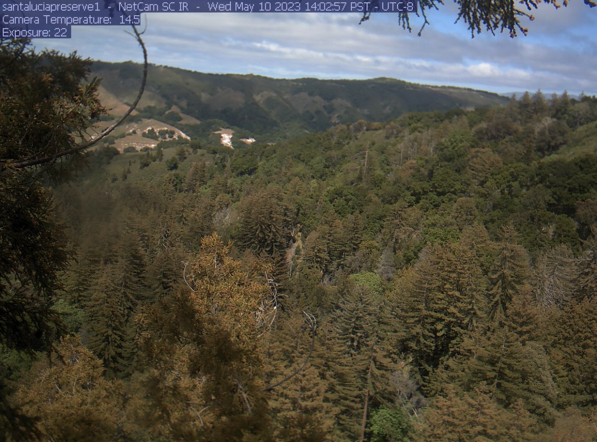
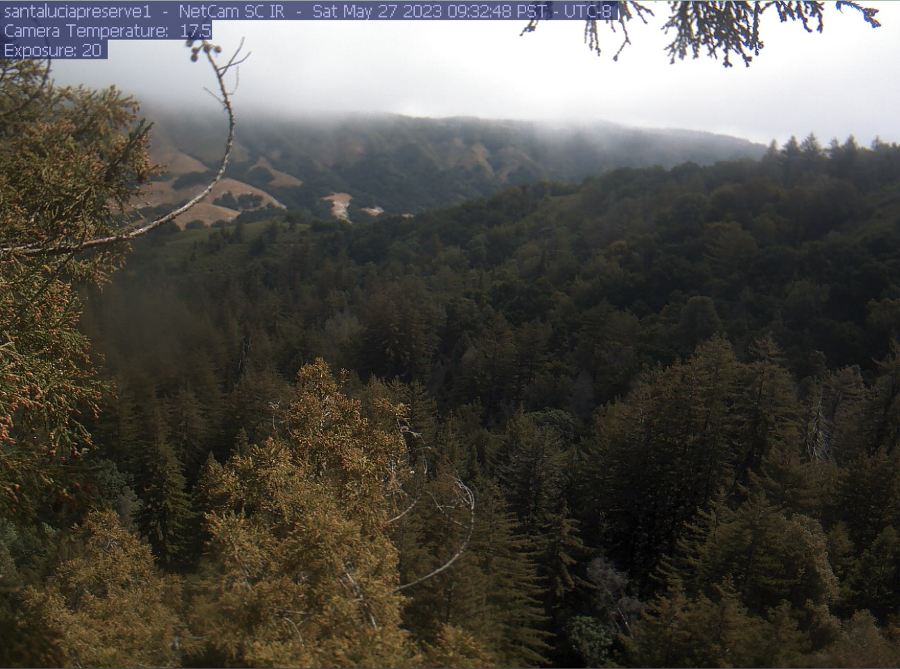
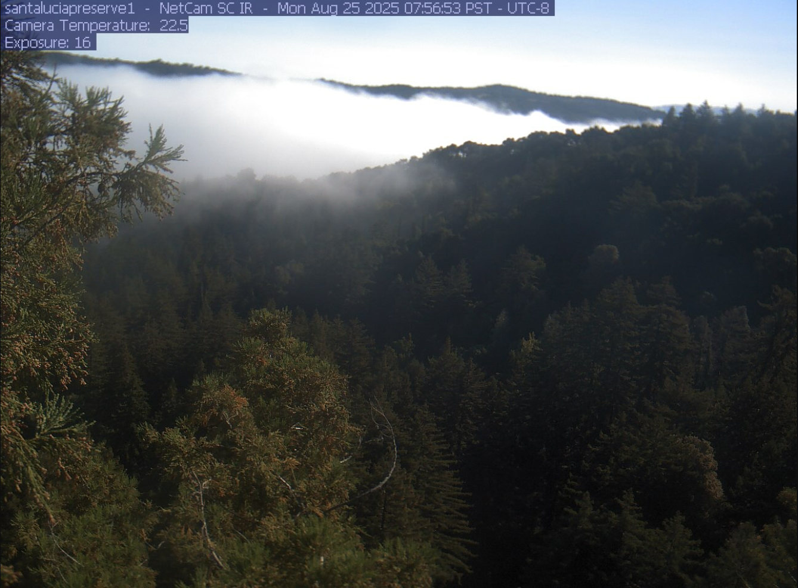
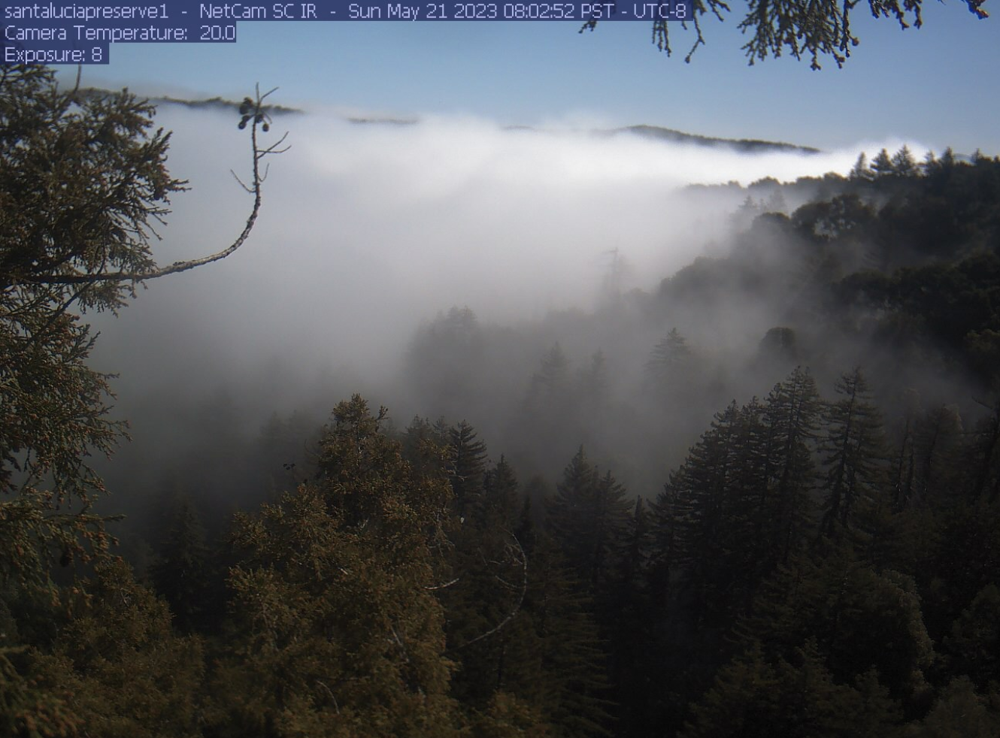
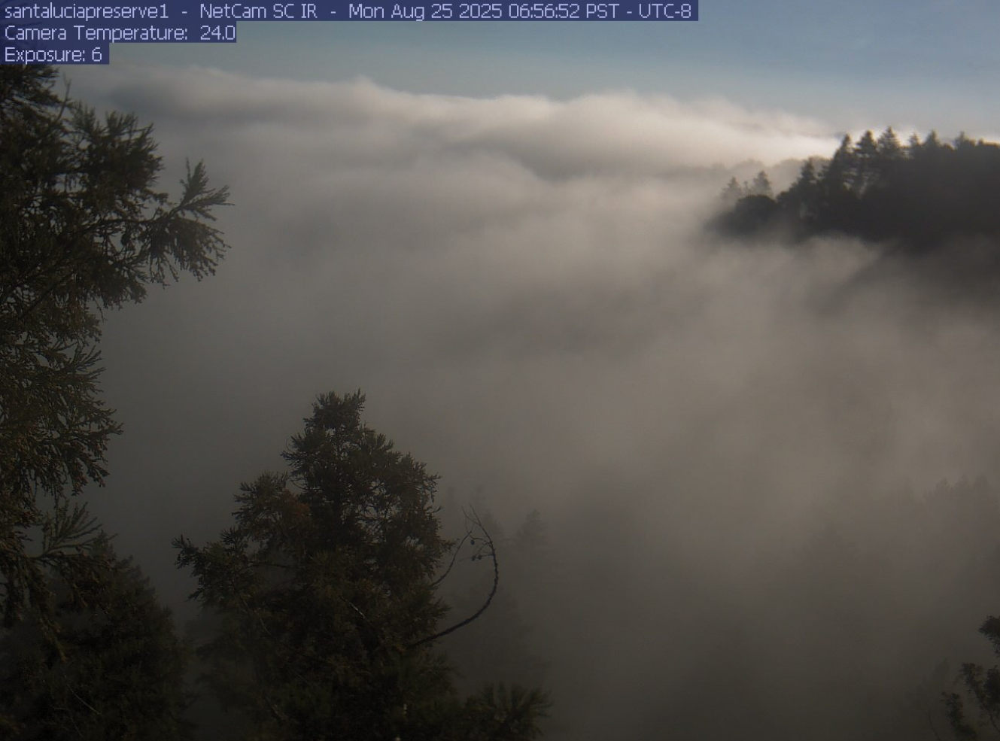
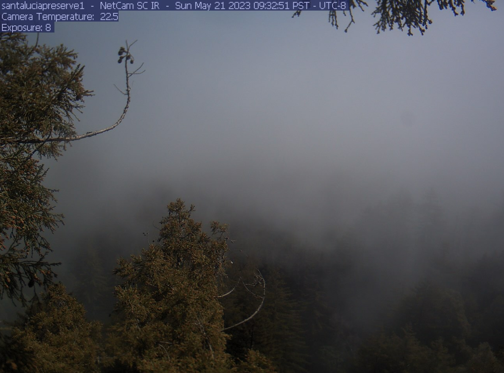
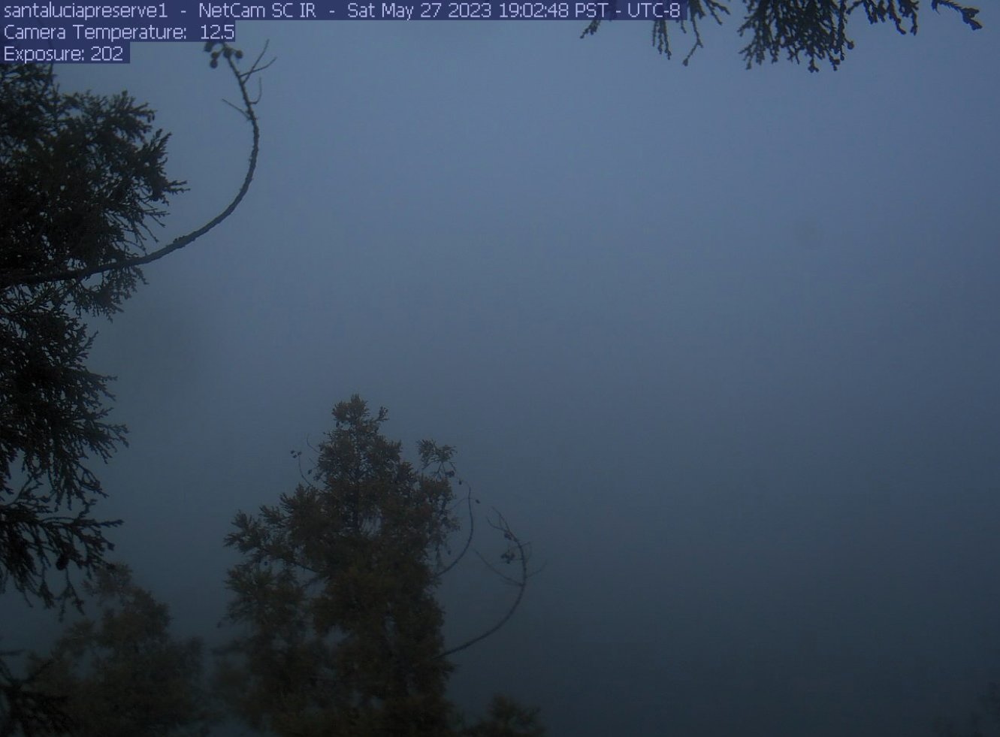

# Fog Classification System

0 - Dark                                

1 - Clear Day  

2 - Light Fog in Background, No Fog in Midground and Foreground

3 - Heavy Fog in Background, No Fog in Midground and Foreground

4 - Heavy Fog in Background, Light Fog in Midground, No Fog in Foreground

5 - Heavy Fog in Background and Midground, No Fog in Foreground

6 - Heavy Fog in Background and Midground, Light Fog in Foreground

7 - Heavy Fog in Background, Midground, and Foreground

